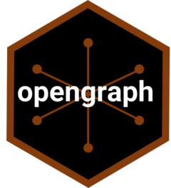

<!-- README.md is generated from README.Rmd. Please edit that file -->

```{r, include = FALSE}
knitr::opts_chunk$set(
  collapse = TRUE,
  comment = '#>',
  fig.path = 'man/figures/README-',
  out.width = '100%'
)
```

# opengraph 

<!-- badges: start -->
[](https://CRAN.R-project.org/package=opengraph)
[](https://christopherkenny.r-universe.dev/opengraph)
[](https://lifecycle.r-lib.org/articles/stages.html#stable)
[](https://github.com/christopherkenny/opengraph/actions/workflows/R-CMD-check.yaml)
[](https://app.codecov.io/gh/christopherkenny/opengraph?branch=main)
<!-- badges: end -->

The goal of `opengraph` is to read and process Open Graph Protocol HTML on websites.

## Installation

You can install the development version of `opengraph` from [GitHub](https://github.com/) with:

``` r
# install.packages('pak')
pak::pak('christopherkenny/opengraph')
```

## Example

This is a relatively simple package. 
The main function is `og_parse()` which returns a named vector of Open Graph metadata found on a given webpage.

```{r parse}
library(opengraph)
url <- 'https://christophertkenny.com/opengraph/'
og_parse(url)
```

The package can also read specific Open Graph properties with `og_property()`.
Properties can be prefixed with `og:` or not.

```{r property}
og_property(url, 'og:title')
og_property(url, 'title')
```

If there is no Open Graph metadata found, `og_parse()` will return an empty named vector.

```{r none}
og_parse('https://cran.r-project.org/')
```


